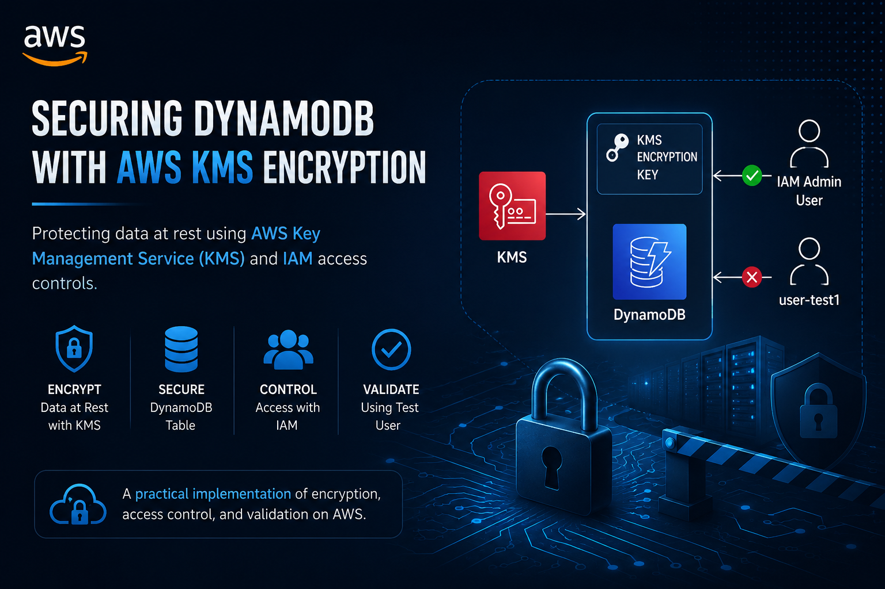
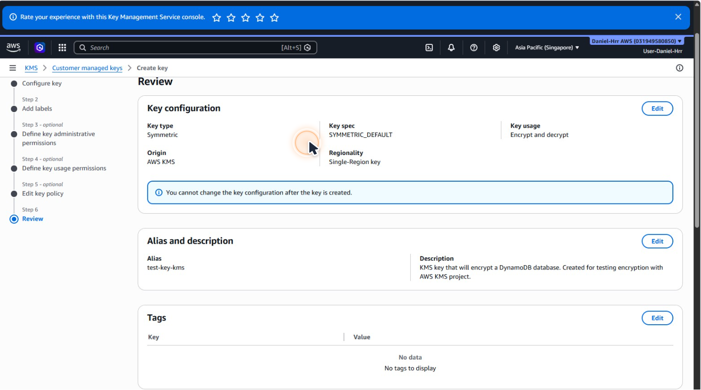
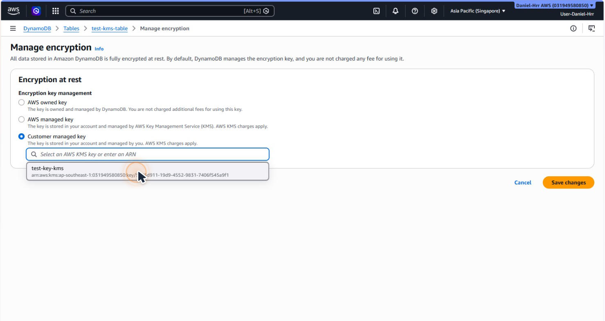
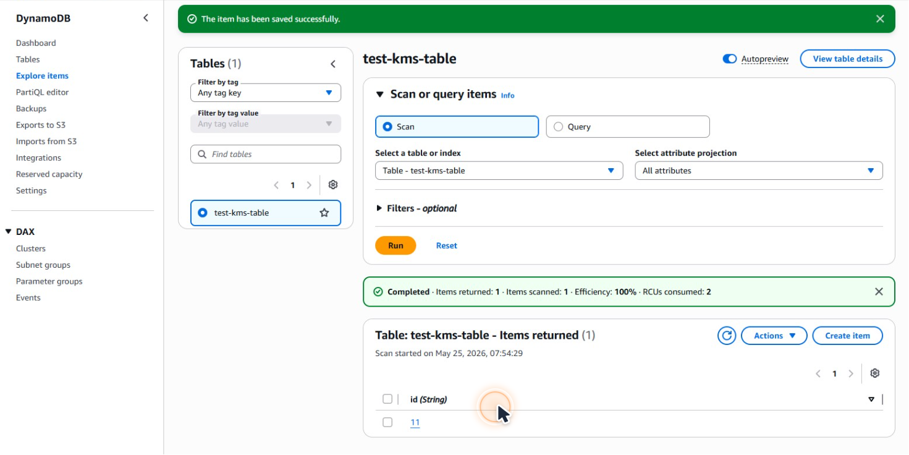
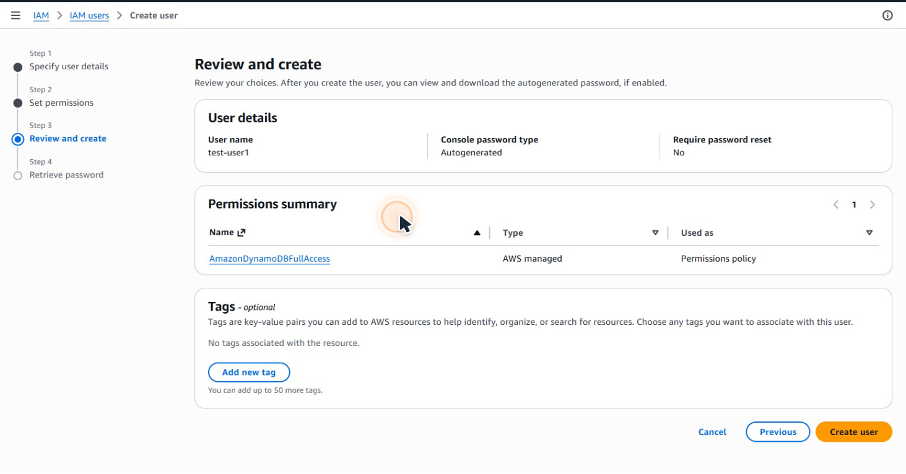
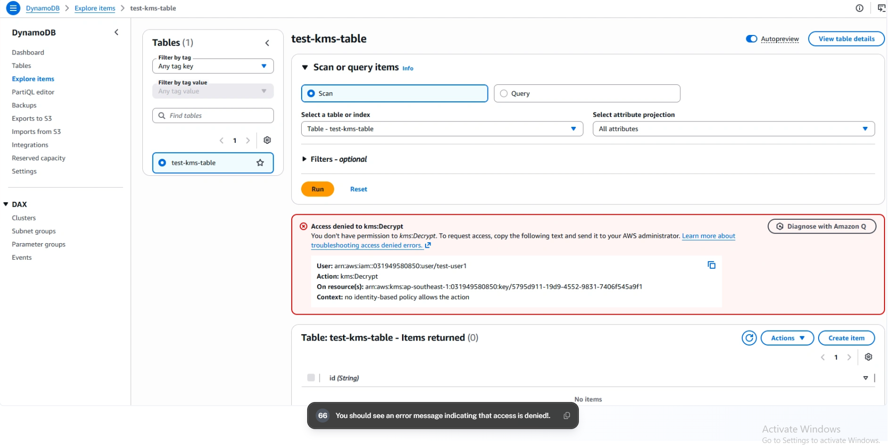

# Encrypting DynamoDB with AWS KMS

## Overview
This project demonstrates how to secure data stored in Amazon DynamoDB using AWS Key Management Service (AWS KMS).
A Customer Managed Key (CMK) was created and attached to a DynamoDB table to provide encryption at rest.
IAM permissions were then tested using a dedicated IAM user to validate access control and data protection.
The project demonstrates how AWS KMS, DynamoDB, and IAM work together to protect sensitive data.

## Architecture Diagram

## Service Used

- AWS KMS ( Key Management Service )
- DynamoDB
- IAM ( Identity Access Management )

## Objectives

- Create a Customer Managed KMS Key
- Encrypt a DynamoDB table using AWS KMS
- Store and retrieve data securely
- Test IAM user access permissions
- Validate encryption and access controls

## Implementation Steps

1. Create encryption keys with AWS KMS
2. Encrypt a DynamoDB database with a KMS key.
3. Add and retrieve data from database to test our encryption.
4. Create IAM user and test accessing the data.
5. Verify access control using an IAM test user.

## KMS Key

## DynamoDB Encryption

## DynamoDB Item

## IAM Test User

## Validation

## Lesson Learned

✔ Created and managed encryption keys using AWS KMS
✔ Encrypted a DynamoDB table with a Customer Managed Key
✔ Added and stored data securely in an encrypted table
✔ Validated encryption controls using an IAM test user
✔ Learned how KMS, DynamoDB, and IAM work together to protect data

## Skill Demonstrated
